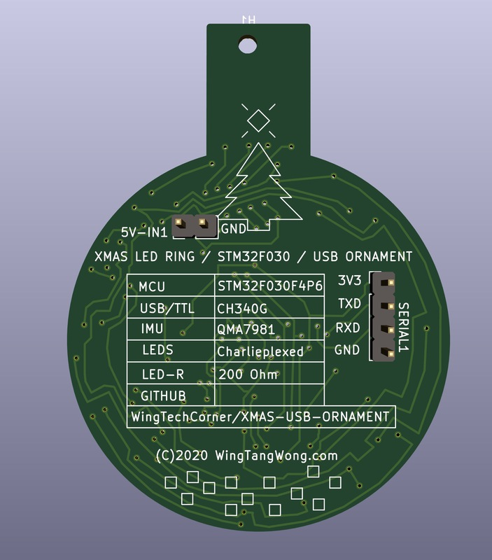

# Wing's XMAS Ornament

* Something for the holidays.
* Made using SMT/SMD components so most/all parts on one side.
* Added header pins on revrse side for adding batteries or different UART(s).
* Added USB-A PCB top to allow plugging into a laptop or computer USB port or to power with a USB-A extension cable.

# JLCPCB Holiday Contest Entry

This is a project I'm also submitting to the [JLCPCB.com](http://www.jlcpcb.com) Holiday Contest!

* http://www.jlcpcb.com

# Components

* CH340G USB-to-TTL interface chip
* AMS1117-3v3 linear voltage regulator
* QMA7981 IMU in I2C mode
* STM32F030F4 - Arm M0 MCU

# STM32 

* 12Mhz External OSC
* Boot0 - CH340G's CTS (pin 9) (pulldown via 4.7K, but can be brought HIGH by CH340G by toggling CTS)

## I2C 

* PA9  - I2C SCL (connects to QMA7981's SCL)
* PA10 - I2C SDA (connects to QMA7981's SDX)
* PB1  - Motion Interrupt Signal ( connects to QMA7981's INT2 )

## UART

* PA2  - UART-TX (connects to CH340G's RX)
* PA3  - UART-RD (connects to CH340G's TX)

## LED Driving Lines

* PA0  - A (CharliePlexed LED Lines)
* PA1  - B (CharliePlexed LED Lines)
* PA4  - C (CharliePlexed LED Lines)
* PA5  - D (CharliePlexed LED Lines)
* PA6  - E (CharliePlexed LED Lines)
* PA7  - F (CharliePlexed LED Lines)
* PA13 - G (CharliePlexed LED Lines)
* PA14 - H (CharliePlexed LED Lines)

# QMA7981

* AD0  - Sets address. Routed to GND for 0. 0x12H
* INT2 - Interrupt signal output. Routed to PB1 on MCU

# CH340G

* TXD  - To MCU RXD
* RXD  - To MCU TXD
* CTS  - To MCU BOOT0 for boot mode selector
* 12Mhz External OSC

